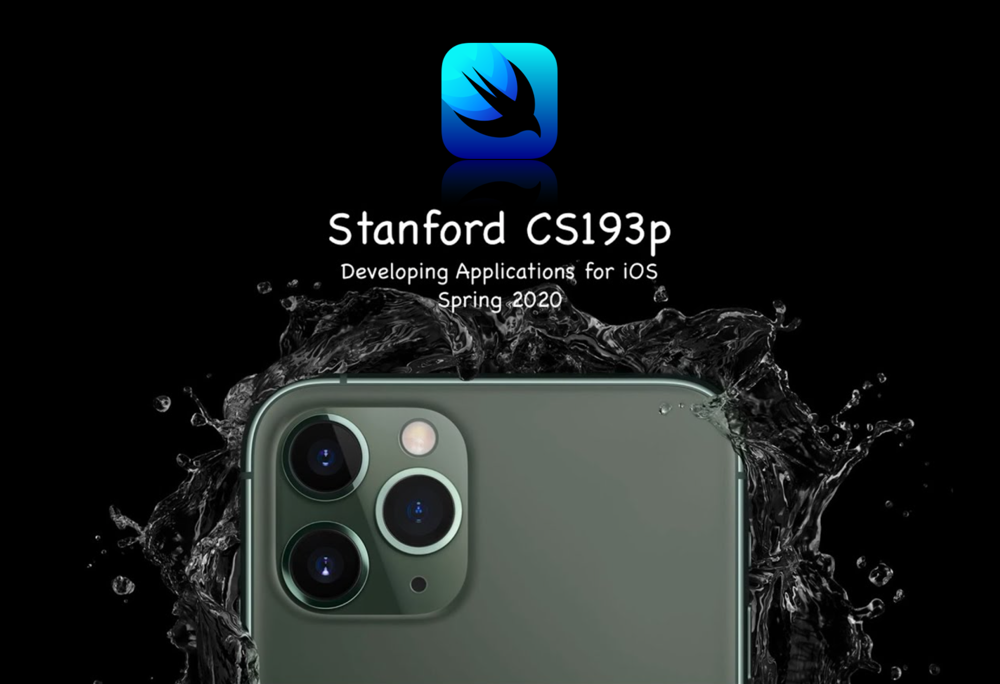

# stanford-cs193p

### Stanford CS193p - Developing Applications for iOS - Spring 2020

### About CS193p

Stanford's CS193p course, Developing Applications for iOS, explains the fundamentals of how to build applications for iPhone and iPad using SwiftUI.  Most recently offered in Spring quarter 2020, the lectures were given to Stanford students in an on-line format due to the novel coronavirus pandemic and are now available to all via Stanford's [YouTube channel](https://www.youtube.com/user/StanfordUniversity).
